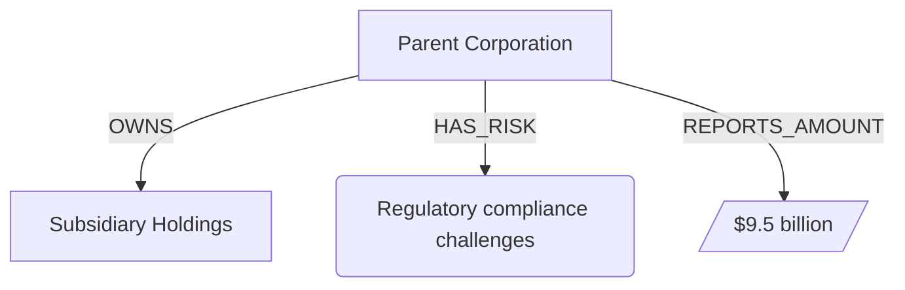

# The Financial Detective

An LLM-powered Knowledge Graph extraction pipeline that transforms unstructured financial documents into structured, validated graph representations.

---

## Overview

The Financial Detective reads raw financial text (e.g., SEC filings, earnings reports, risk disclosures) and extracts a structured Knowledge Graph containing:

- **Companies** — Organizations mentioned in the document
- **Risk Factors** — Business risks and uncertainties disclosed
- **Dollar Amounts** — Monetary figures reported

The system features a provider-agnostic architecture supporting OpenAI GPT-4o, Google Gemini, and local Ollama models for intelligent entity and relationship extraction, then validates the output against a strict schema before rendering a visual graph. All extracted entities and relationships must be explicitly present in the source text.

---

## Problem Statement

Financial documents contain critical information buried in unstructured text:

- Ownership structures between companies
- Risk exposures and their associated entities
- Monetary amounts tied to specific disclosures

Manually extracting this information is time-consuming and error-prone. Traditional regex-based approaches fail to capture the semantic relationships and contextual nuances present in natural language financial disclosures.

**Goal:** Automatically extract a validated Knowledge Graph from raw financial text with high accuracy and strict anti-hallucination guarantees enforced by prompt constraints and schema validation.

---

## Design Highlights

- **Provider-Agnostic LLM Architecture** — Swap between OpenAI, Google Gemini, and Ollama via environment variables with no code changes
- **Factory Pattern for Extractor Selection** — Clean separation between configuration and implementation
- **Automatic Document Chunking** — Large documents automatically split into manageable chunks with intelligent merging
- **Strict Schema Enforcement** — Pydantic v2 models with `extra="forbid"` reject unexpected fields
- **No-Regex, LLM-Only Extraction** — All entity and relationship extraction performed through LLM reasoning
- **Fail-Fast Validation** — Errors surface immediately with descriptive messages; no silent failures
- **Optional Confidence Scores** — Relationships may include confidence values for future UI, analytics, or human review (currently optional and model-dependent)

---

## Why LLM Over Regex?

| Aspect | Regex / Pattern Matching | LLM-Based Extraction |
|--------|--------------------------|----------------------|
| **Semantic Understanding** | None — matches surface patterns only | Understands context, synonyms, and implied relationships |
| **Variation Handling** | Requires exhaustive pattern enumeration | Generalizes across phrasing variations |
| **Relationship Extraction** | Extremely difficult to capture cross-sentence references | Naturally handles coreference and multi-hop reasoning |
| **Maintenance Burden** | High — patterns break with new document formats | Low — prompt adjustments handle new cases |
| **Entity Disambiguation** | Manual rules required | Contextual reasoning resolves ambiguity |
| **Negation & Qualification** | Prone to false positives | Understands "not," "except," "excluding" |

**Fact:** Financial documents use varied phrasing for the same concepts. "Revenue of $1.2B," "reported earnings totaling $1.2 billion," and "$1,200M in net sales" all express similar information but require different regex patterns. An LLM handles all variations naturally.

---

## Architecture

```
┌─────────────────────────────────────────────────────────────────────────┐
│                         FINANCIAL DETECTIVE PIPELINE                     │
└─────────────────────────────────────────────────────────────────────────┘

   ┌──────────────┐     ┌──────────────┐     ┌──────────────┐
   │              │     │              │     │              │
   │  raw_report  │────▶│ input_loader │────▶│  Raw Text    │
   │    .txt      │     │              │     │   (str)      │
   │              │     │              │     │              │
   └──────────────┘     └──────────────┘     └──────┬───────┘
                                                   │
                                                   ▼
                       ┌──────────────────────────────────────┐
                       │         extractor package            │
                       │  ┌────────────────────────────────┐  │
                       │  │  extractor factory + providers │  │
                       │  │   (temperature=0, JSON mode)   │  │
                       │  └────────────────────────────────┘  │
                       └──────────────────┬───────────────────┘
                                          │
                                          ▼
                                 ┌─────────────────┐
                                 │ KnowledgeGraph  │
                                 │   (Pydantic)    │
                                 └────────┬────────┘
                                          │
                                          ▼
                       ┌──────────────────────────────────────┐
                       │           validator.py               │
                       │  • Unique node IDs                   │
                       │  • Valid relationship references     │
                       │  • At least one node                 │
                       └──────────────────┬───────────────────┘
                                          │
                        ┌─────────────────┴─────────────────┐
                        │                                   │
                        ▼                                   ▼
              ┌─────────────────┐                 ┌─────────────────┐
              │  graph_output   │                 │   visualizer    │
              │     .json       │                 │    (NetworkX)   │
              │                 │                 │                 │
              └─────────────────┘                 └────────┬────────┘
                                                          │
                                                          ▼
                                                 ┌─────────────────┐
                                                 │   graph.png     │
                                                 │  (matplotlib)   │
                                                 └─────────────────┘
```

### Module Responsibilities

| Module | Responsibility |
|--------|----------------|
| `src/schema.py` | Pydantic models for Node, Relationship, KnowledgeGraph |
| `src/input_loader.py` | Load raw text from file (no parsing) |
| `src/config.py` | Configuration management via environment variables |
| `src/chunker.py` | Text chunking for large documents |
| `src/graph_merger.py` | Merge multiple KnowledgeGraph instances |
| `src/extractor/` | LLM extractor package (factory, base interface, OpenAI & Ollama implementations) |
| `src/validator.py` | Schema validation and integrity checks |
| `src/visualizer.py` | NetworkX graph construction and PNG rendering (optional) |
| `src/visualizer_mermaid.py` | Mermaid flowchart generation (always available) |
| `main.py` | Pipeline orchestration |

---

## LLM Provider Configuration

The Financial Detective supports multiple LLM providers, allowing you to choose between cloud-based and local inference.

### Supported Providers

| Provider | Model | Use Case |
|----------|-------|----------|
| **OpenAI** | GPT-4o | Production-grade accuracy, cloud-based |
| **Google Gemini** | gemini-2.0-flash, gemini-1.5-pro, etc. (configurable via `GEMINI_MODEL`) | High-quality cloud-based extraction (Google ecosystem) |
| **Ollama** | Llama 3, Mistral, etc. | Local inference, offline capable |

### Environment Variables

| Variable | Description | Default |
|----------|-------------|---------|
| `LLM_PROVIDER` | Provider selection: `openai`, `gemini`, or `ollama` | `openai` |
| `OPENAI_API_KEY` | OpenAI API key (required for OpenAI provider) | — |
| `GEMINI_API_KEY` | Google Gemini API key (required for Gemini provider) | — |
| `GEMINI_MODEL` | Gemini model name | `gemini-2.0-flash` |
| `OLLAMA_MODEL` | Ollama model name | `llama3:latest` |
| `OLLAMA_BASE_URL` | Ollama API endpoint | `http://localhost:11434` |
| `CHUNK_ENABLED` | Enable document chunking for large texts | `true` |
| `CHUNK_SIZE_TOKENS` | Target number of tokens per chunk | `4000` |
| `CHUNK_OVERLAP_TOKENS` | Overlap tokens between chunks | `200` |

### Usage Examples

**Using OpenAI GPT-4o (default):**

```bash
export LLM_PROVIDER="openai"
export OPENAI_API_KEY="sk-your-api-key-here"
python main.py
```

**Using Ollama (local inference):**

```bash
# Start Ollama server (if not already running)
ollama serve &

# Pull the model (first time only)
ollama pull llama3:latest

# Run extraction
export LLM_PROVIDER="ollama"
export OLLAMA_MODEL="llama3:latest"
python main.py
```

**Using Ollama with a different model:**

```bash
export LLM_PROVIDER="ollama"
export OLLAMA_MODEL="mistral"
python main.py
```

**Using Google Gemini:**

```bash
export LLM_PROVIDER="gemini"
export GEMINI_API_KEY="your-gemini-api-key"
export GEMINI_MODEL="gemini-2.0-flash"
python main.py
```

> **Tip:** Ollama runs entirely on your local machine, avoiding OpenAI API quota limits and rate throttling. This makes it ideal for iterative development, testing, and processing large document batches without incurring costs.

### Design Benefits

This provider-agnostic design enables:

- **Cost Control** — Use local Ollama models for development and testing to reduce API costs
- **Offline Fallback** — Run extractions without internet connectivity using Ollama
- **Model Experimentation** — Swap models without code changes to compare extraction quality
- **Privacy** — Keep sensitive financial documents on-premises with local inference
- **Large Context Windows** — Gemini offers strong reasoning and large context windows; models like `gemini-2.0-flash` or `gemini-1.5-flash` can be swapped via `GEMINI_MODEL`

---

## Document Chunking

The Financial Detective automatically handles large documents that exceed LLM context windows through intelligent chunking.

### How It Works

When chunking is enabled and a document exceeds the configured size:

1. **Text Splitting** — Document is split into overlapping chunks at natural boundaries (paragraphs, sentences)
2. **Parallel Extraction** — Each chunk is processed independently by the LLM
3. **Graph Merging** — All extracted graphs are combined into a single unified Knowledge Graph

### Configuration

| Variable | Description | Default |
|----------|-------------|---------|
| `CHUNK_ENABLED` | Enable/disable automatic chunking | `true` |
| `CHUNK_SIZE_TOKENS` | Target tokens per chunk (approximate) | `4000` |
| `CHUNK_OVERLAP_TOKENS` | Tokens to overlap between chunks | `200` |

**Recommended Settings:**

- **Ollama (local):** `CHUNK_SIZE_TOKENS=4000` — Conservative limit for local models
- **OpenAI GPT-4o:** `CHUNK_SIZE_TOKENS=32000` — Utilize larger context window
- **Google Gemini:** `CHUNK_SIZE_TOKENS=50000` — Take advantage of massive context window

### Example: Processing Large Documents

```bash
export LLM_PROVIDER=ollama
export CHUNK_ENABLED=true
export CHUNK_SIZE_TOKENS=4000
export CHUNK_OVERLAP_TOKENS=200

python main.py
```

### Design Decisions

- **Simple Merge Strategy** — All nodes and relationships from chunks are concatenated (no deduplication)
- **Semantic Boundaries** — Text is split at paragraph/sentence boundaries to preserve context
- **Overlap Preservation** — Chunks overlap to maintain continuity across boundaries
- **Fail-Fast** — If any chunk extraction fails, the entire process fails immediately

---

## Setup Instructions

### Prerequisites

- Python 3.11+ (Python 3.11–3.13 recommended for full visualization support)
- One of the following LLM providers:
  - **OpenAI** — API key with GPT-4o access
  - **Google Gemini** — API key for Gemini models
  - **Ollama** — Local installation (no API key required)

### Installation

1. **Clone the repository:**
   ```bash
   git clone <repository-url>
   cd financial-detective
   ```

2. **Create and activate a virtual environment:**
   ```bash
   python -m venv venv
   source venv/bin/activate  # On Windows: venv\Scripts\activate
   ```

3. **Install dependencies:**
   ```bash
   pip install -r requirements.txt
   ```

4. **Set up environment variables:**

   Copy the example configuration file and edit it:
   ```bash
   cp .env.example .env
   ```

   Edit `.env` with your settings:
   ```bash
   # For OpenAI:
   LLM_PROVIDER=openai
   OPENAI_API_KEY=sk-your-api-key-here

   # For Google Gemini:
   LLM_PROVIDER=gemini
   GEMINI_API_KEY=your-gemini-api-key
   GEMINI_MODEL=gemini-2.0-flash

   # For Ollama (local, no API key needed):
   LLM_PROVIDER=ollama
   OLLAMA_MODEL=llama3:latest
   ```

   > **Note:** The `.env` file is automatically loaded at startup and is excluded from version control via `.gitignore`.

---

## How to Run

### Quick Start (Local, No API Key)

```bash
ollama serve &
ollama pull llama3:latest

export LLM_PROVIDER=ollama
export OLLAMA_MODEL=llama3:latest

python main.py
```

### Prepare Input Data

Place your financial document in `data/raw_report.txt`:

```bash
echo "Sample Corp reported revenue of \$1.2 billion..." > data/raw_report.txt
```

### Run the Pipeline

```bash
python main.py
```

### Expected Output

```
[1/5] Loading raw financial text...
      Loaded 1234 characters
[2/5] Extracting Knowledge Graph via LLM...
      Extracted 5 nodes and 3 relationships
[3/5] Validating Knowledge Graph...
      Validation passed
[4/5] Saving graph to data/graph_output.json...
      Graph saved successfully
[5/5] Rendering graph visualizations...
      PNG saved to visuals/graph.png
      Mermaid saved to visuals/graph.mmd

✓ Pipeline completed successfully
```

### Output Files

| File | Description |
|------|-------------|
| `data/graph_output.json` | Structured Knowledge Graph in JSON format |
| `visuals/graph.png` | NetworkX graph visualization (PNG image) |
| `visuals/graph.mmd` | Mermaid diagram for lightweight rendering |

---

## Mermaid Visualization

The pipeline generates a Mermaid flowchart diagram (`visuals/graph.mmd`) in addition to the PNG image. Mermaid diagrams are lightweight, text-based, and render natively on GitHub.

### Node Shapes

| Entity Type | Mermaid Shape |
|-------------|---------------|
| Company | Rectangle `["label"]` |
| RiskFactor | Rounded `("label")` |
| DollarAmount | Parallelogram `[/"label"/]` |

### Example Output



### GitHub Rendering

GitHub automatically renders `.mmd` files and Mermaid code blocks in Markdown. You can:

- View `visuals/graph.mmd` directly in the GitHub file browser
- Embed the diagram in issues, PRs, or documentation
- Copy the Mermaid code into any Mermaid-compatible tool

---

## Testing Instructions

### Run All Tests

```bash
pytest tests/ -v
```

### Run Specific Test Modules

```bash
pytest tests/test_validator.py -v    # Validator tests
pytest tests/test_extractor.py -v    # Extractor tests (mocked factory; provider-agnostic)
pytest tests/test_visualizer.py -v   # Visualizer tests
```

### Test Coverage

```bash
pytest tests/ --cov=src --cov-report=term-missing
```

> **Note:** Unit tests mock the LLM factory to avoid API calls. For integration validation with Gemini or Ollama, run `python main.py` with the appropriate `LLM_PROVIDER` environment variable.

---

## Limitations and Assumptions

### Assumptions

1. **Single Document Input** — The pipeline processes one document at a time from `data/raw_report.txt`.

2. **English Language** — The system prompt and extraction logic assume English-language financial documents.

3. **Cloud API Availability** — OpenAI and Gemini require active internet connection and valid API keys. Ollama runs locally without API dependency.

4. **Schema Conformance** — Extracted entities must fit into three categories: Company, RiskFactor, or DollarAmount.

5. **Relationship Types** — Only three relationship types are supported: OWNS, HAS_RISK, REPORTS_AMOUNT.

### Limitations

1. **LLM Variability** — Despite temperature=0, minor output variations may occur across API versions.

2. **Token Limits** — Very large documents may exceed context limits (~128K tokens for GPT-4o; up to 1M+ for Gemini). Chunking is enabled by default to handle large documents.

3. **No Incremental Updates** — Each run extracts a fresh graph; no merge with previous extractions.

4. **No Entity Resolution** — Similar entity names with slight variations may be treated as separate entities.

5. **Cost** — Cloud providers (OpenAI, Gemini) incur API costs proportional to document length. Ollama runs locally without API cost.

6. **No Real-Time Processing** — Batch processing only; not suitable for streaming input.

7. **OpenAI API Quota Dependency** — OpenAI provider is subject to rate limits and quota restrictions. Ollama provides a local fallback that avoids these constraints.

8. **Python 3.14 Visualization** — NetworkX has an upstream compatibility issue with Python 3.14. Graph visualization is automatically skipped on this version; use Python 3.11–3.13 for full functionality.

### Security Considerations

- API keys should be stored in environment variables, never committed to version control.
- Raw financial documents may contain sensitive information; handle appropriately.

---

## Project Structure

```
financial-detective/
├── data/
│   ├── raw_report.txt        # Input: Raw financial text
│   └── graph_output.json     # Output: Extracted Knowledge Graph
├── src/
│   ├── schema.py             # Pydantic data models
│   ├── input_loader.py       # Raw text loading
│   ├── config.py             # Environment-based configuration
│   ├── chunker.py            # Text chunking for large documents
│   ├── graph_merger.py       # Merge multiple KnowledgeGraphs
│   ├── validator.py          # Graph validation
│   ├── visualizer.py         # Graph rendering
│   └── extractor/            # LLM extractor package
│       ├── __init__.py       # Package entry point (with chunking orchestration)
│       ├── base.py           # Abstract LLMExtractor interface
│       ├── factory.py        # Provider selection factory
│       ├── openai_llm.py     # OpenAI GPT-4o implementation
│       ├── gemini_llm.py     # Google Gemini implementation
│       └── ollama_llm.py     # Ollama local implementation
├── tests/
│   ├── test_validator.py     # Validator unit tests
│   ├── test_extractor.py     # Extractor unit tests
│   ├── test_factory.py       # Factory unit tests
│   ├── test_chunker.py       # Chunker unit tests
│   ├── test_graph_merger.py  # Graph merger unit tests
│   └── test_visualizer.py    # Visualizer unit tests
├── visuals/
│   ├── graph.png             # NetworkX visualization (if available)
│   └── graph.mmd             # Mermaid diagram
├── main.py                   # Pipeline orchestration
├── requirements.txt          # Python dependencies
└── README.md                 # This file
```

---

## License

MIT License — See LICENSE file for details.
